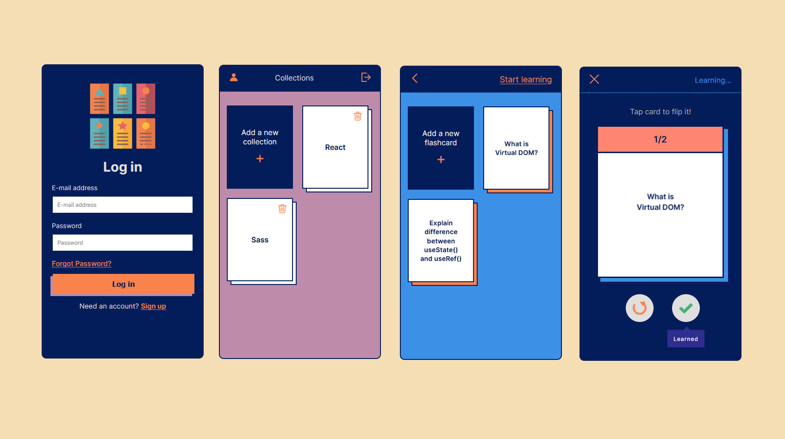

## 🎓 About
#### What are flashcards? There are small note cards used for memorizing information. Flashcards are typically two-sided, with the prompt on one side and the information about the prompt on the other. 

#### This simple app makes it simple to create your own flashcards and helps you to study better!

## ⚡ Demo

Click the link and start learning: https://mindspaces.herokuapp.com/

## 🐥 Functionalities

* Registration & logging in
* Profile update
* Password reminder
* Creating and deleting collections
* Creating flashcards in the collections
* Animated learning process:
    * Cards go to 2 categories: learned or needs practice.
    * When set is finished user decides whether start learning from beginning or contuinue learning cards that still needs practice.

## ✨ Technologies

* React.js with Hooks
* React Router
* React Context API
* Firebase
* Webpack
* Babel
* SASS
* CSS animations

## 🌷 Contribute
Icons made by:
* Flaticon: https://www.flaticon.com
* Freepik: https://www.freepik.com

